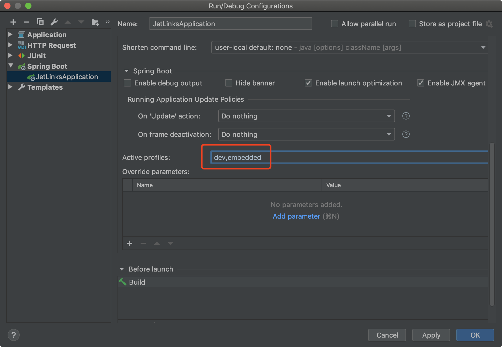

# JetLinks 专业版

```bash
---jetlinks-pro
------|---jetlinks-components   # 组件库.
------|-------|----common-component # 通用组件.
------|-------|----dashboard-component # 仪表盘.
------|-------|----elasticsearch-component # elasticsearch集成.
------|-------|----gateway-component # 网关组件,消息网关,设备接入.
------|-------|----io-component # IO 组件,Excel导入导出等.
------|-------|----logging-component # 日志组件
------|-------|----messaging-component # 消息中间件组件,RabbitMQ,Kafka等
------|-------|----network-component # 网络组件,MQTT,TCP,CoAP,UDP等
------|-------|----notify-component # 通知组件,短信,右键等通知
------|-------|----protocol-component # 协议组件
------|-------|----rule-engine-component # 规则引擎
------|-------|----timeseries-component # 时序数据组件
------|---jetlinks-manager  # 管理功能
------|-------|----authentication-manager   # 用户,权限管理
------|-------|----device-manager   # 设备管理
------|-------|----logging-manager   # 日志管理
------|-------|----network-manager   # 网络组件管理
------|-------|----notify-manager   # 通知管理
------|-------|----visualization-manager   # 数据可视化管理
------|-------|----rule-engine-manager   # 规则引擎管理
------|---jetlinks-openapi  #OpenAPI
------|-------|----jetlinks-openapi-core    #OpenAPI核心模块
------|-------|----jetlinks-openapi-manager    #OpenAPI管理
------|---jetlinks-parent   # 父模块,统一依赖管理
------|---simulator     # 模拟器

```

## 获取代码

第一步: 先到个人设置中[添加SSH key](https://github.com/settings/keys)

第二步: 拉取代码

```bash
 $ git clone --recurse-submodules git@github.com:jetlinks/jetlinks-pro.git && git submodule foreach git checkout master
```

第三步: 更新代码

JetLinks Pro使用`git多模块`管理,使用此命令更新全部模块.
```bash
$ git pull && git submodule init && git submodule update && git submodule foreach git checkout master && git submodule foreach git pull origin master
```

添加代码到自建仓库(自行修改仓库地址):

```bash
$  git remote add gitee "git@gitee.com:/jetlinks/$(echo ${PWD##*/}).git"
$  git submodule foreach 'git remote add gitee "git@gitee.com:/jetlinks/$(echo ${PWD##*/}).git"'
$  git push gitee master
$  git submodule foreach git push gitee master 
```

## 文档

[查看文档](http://doc.jetlinks.cn/)


## 开发

开发之前,你应该对`java8`,`maven`,`spring-boot`,`reactor`,有一定了解.

推荐使用Idea作为集成开发环境.

推荐使用docker来快速启动完整的开发所需要的相关环境,比如:redis,postgresql,elasticsearch等.
如果无法在开发环境中使用docker. 可使用内嵌方式启动开发环境.

### docker方式启动开发环境

直接在项目目录下运行命令即可:

```bash

$ docker-compose up -d

```

### 内嵌方式启动

修改`jetlinks-standalone/src/main/resources/application.yml`中的环境配置.

```bash
spring:
  profiles:
    active: dev,embedded
```

或者修改Idea中的启动配置:




注意: 此方式默认会以内嵌方式启动redis,h2db,elasticsearch.可根据实际情况修改`application-embedded.yml`中
的配置.

## 部署

项目发布基于`spring-boot`,可以使用spring-boot打成jar包的方式启动:

```bash
./mvnw clean package -Dmaven.test.skip=true
```

执行此命令成功后,`jetlinks-standalone/target/jetlinks-standalone.jar`则为可以直接运行的jar包.

如果在docker环境下使用,可以构建成docker镜像:

```bash

#先打包
./mvnw clean package -Dmaven.test.skip=true

#构建docker镜像,可根据情况修改docker.image.name配置
cd jetlinks-standalone
../mvnw docker:build -Ddocker.image.name=jetlinks-pro

```

构建好镜像后可推送到自己到docker仓库中.
